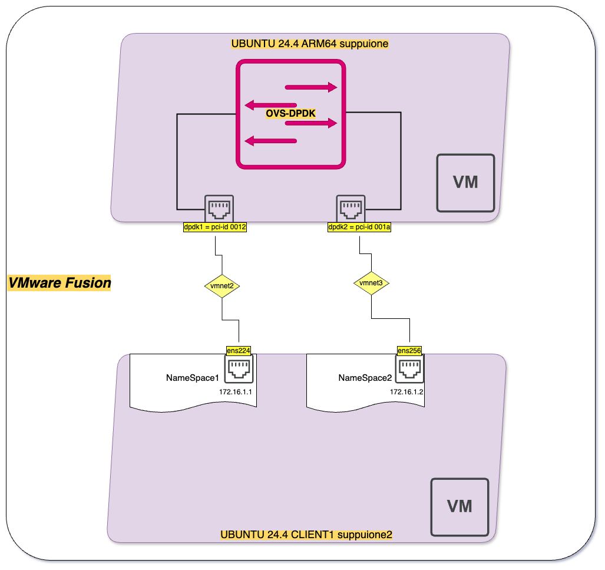

# mac-m1-dpdklab
dpdk installation and testing on a MAC M1 with VMware Fusion 

# the "executive" summary 
the intent of this project is to help all the people compiling dpdk apps for testing purposes on a MAC M1 (arm64-based) laptop. Considering the huge limitation of M1's about not allowing nested VM's, the lab uses external VM's to push traffic into OVS-dpdk. 

# hardware and software setup 
1. Any MAC with arm64 cpu would fit, in this case i'm using a 2021 MacBook PRO.
2. macOS 14.4 Sonoma and VMware Fusion 13.5.2
3. the VM used in the lab: Ubuntu 24.4-LTS ARM64 for both client and OVS hosts, `ubuntu-24.04-live-server-arm64.iso` is the one i've used. 
4. hardware setup for the Ubuntu VM is as follows:
   - 4 processors
   - 8GB RAM
   - 100GB disk (thin)
   - 4 network interfaces
     - 1st is shared with your MAC or attached to a bridge in case you need SSH access from local terminal 
     - 2nd, 3rd and 4th are connected to isolated network (vmnet2/vmnet3 in Fusion) 
5. once Ubuntu installation is done set you preferred access method (ssh requires ens160 IP address setup, VNC, or login straight from Fusion console)
6. on the VM let's check internet connectivity, issue ```apt -y update; apt -y upgrade```, go to next section. 

# dpdk installation and packages 
1. Download the dpdk tar archive from [official dpdk.org link](https://core.dpdk.org/download/) preferring an LTS version.
2. Official installation instructions for Linux [here](https://doc.dpdk.org/guides/linux_gsg/index.html)
3. as root, follow chapter 2.2. Compilation of the DPDK - Required Tools and Libraries is not exactly as in the docs, for Ubuntu 24.4 you can do it all via apt: 
   - ``` apt -y install build-essential ``` 
   - ``` apt -y install meson ``` (it will take care of ninja2 as well) 
   - ``` apt -y install python3-pyelftools ```
   - ``` apt -y install libnuma-dev ```
4. Reserving Hugepages for DPDK it's an important requirement:
   - ``` echo 2048 > /sys/devices/system/node/node0/hugepages/hugepages-2048kB/nr_hugepages ```
   - to keep it across reboots, edit `/etc/default/grub`
   - add `GRUB_CMDLINE_LINUX_DEFAULT="hugepages=2048"` and then ``` update-grub ```
5. untar the dpdk archive, cd into the extracted directory
6. ```meson setup <options> build ``` now for the options since dpdk does not support Apple's Silicon ARM64 (only BlueField, DPAA, DPAA2 and OCTEON are currently supported) we need to specify a generic Platform to make it finish the build process, as a consequence we do not get a configuration optimized build for the M1 SoC.
    -  ``` meson setup -Dplatform=generic build ```
    -  ``` cd build ```
    -  ``` ninja ```
    -  ``` ninja install ```
    -  ``` ldconfig ```
7. you can see the newly compiled dpdk libraries in your `/usr/local/lib/aarch64-linux-gnu/` directory 

## the driver choice

for some unknown reason that i've not investigated further, i could not use the vfio-pci driver (more secure) as per ovs-dpdk documentation suggests. 

the root cause of this could lie in the M1 silicon not allwing nested VM or not having the intel VT-d extensions, in any case binding interfaces on the M1 with vfio-pci on a running VM wasn't working hence, for simulation purposes, it's ok to stick with the uio_pci_generic driver which does not support virtual functions, so these ports can't be bound to sr-iov based network functions. 

We can now load the PMD (virtio Poll Mode Driver) driver with modprobe, then check with lsmod the correct loading 
```root@suppuione:~/modprobe uio_pci_generic``` 

Now it's time to bind interfaces to dpdk drivers, on the directory as `~/dpdk-stable-23.11.1/usertools#` there's a command line utility that lists interfaces and the drivers they are using 
```
root@suppuione:~/dpdk-stable-23.11.1/usertools# ./dpdk-devbind.py -s

Network devices using kernel driver
===================================
0000:02:00.0 '82574L Gigabit Network Connection 10d3' if=ens160 drv=e1000e unused=uio_pci_generic *Active*
0000:0a:00.0 '82574L Gigabit Network Connection 10d3' if=ens192 drv=e1000e unused=uio_pci_generic 
0000:12:00.0 '82574L Gigabit Network Connection 10d3' if=ens224 drv=e1000e unused=uio_pci_generic 
0000:13:00.0 '82574L Gigabit Network Connection 10d3' if=ens225 drv=e1000e unused=uio_pci_generic 
0000:1a:00.0 '82574L Gigabit Network Connection 10d3' if=ens256 drv=e1000e unused=uio_pci_generic 
```

I will associate ens192 and ens224 to uio driver, be aware that interfaces shall be in DOWN state and unconfigured: 

```
root@suppuione:~/dpdk-stable-23.11.1/usertools# ./dpdk-devbind.py -b uio_pci_generic ens192
root@suppuione:~/dpdk-stable-23.11.1/usertools# ./dpdk-devbind.py -b uio_pci_generic ens224
root@suppuione:~/dpdk-stable-23.11.1/usertools# ./dpdk-devbind.py -s
```

the listing command now shows the dpdk-compatible driver devices: 
```
Network devices using DPDK-compatible driver
============================================
0000:0a:00.0 '82574L Gigabit Network Connection 10d3' drv=uio_pci_generic unused=e1000e
0000:12:00.0 '82574L Gigabit Network Connection 10d3' drv=uio_pci_generic unused=e1000e

Network devices using kernel driver
===================================
0000:02:00.0 '82574L Gigabit Network Connection 10d3' if=ens160 drv=e1000e unused=uio_pci_generic *Active*
0000:13:00.0 '82574L Gigabit Network Connection 10d3' if=ens225 drv=e1000e unused=uio_pci_generic 
0000:1a:00.0 '82574L Gigabit Network Connection 10d3' if=ens256 drv=e1000e unused=uio_pci_generic 
```

we are now ready to bring up an ovs-switch and have it using the dpdk ports. 

# ovs-dpdk installation from packages and setup 

On ubuntu we can follow instructions as per this [link](https://ubuntu.com/server/docs/how-to-use-dpdk-with-open-vswitch) with the only exception for the whitelisting flag that has been deprecated and replaced by `--allow`

```
apt-get install openvswitch-switch-dpdk
update-alternatives --set ovs-vswitchd /usr/lib/openvswitch-switch-dpdk/ovs-vswitchd-dpdk
ovs-vsctl set Open_vSwitch . "other_config:dpdk-init=true"
# run on core 0 only, required for library tasks not for DP 
ovs-vsctl set Open_vSwitch . "other_config:dpdk-lcore-mask=0x1"
# Allocate 2G huge pages (not Numa node aware)
ovs-vsctl set Open_vSwitch . "other_config:dpdk-alloc-mem=2048"
#(optional step) limit to two comma-separated whitelisted device, using the pci-address : 
ovs-vsctl set Open_vSwitch . "other_config:dpdk-extra=--allow=0000:0a:00.0,0000:12:00.0,0000:1a:00.0"
service openvswitch-switch restart
```

let's check status of the newly created ovs-dpdk switch with the port bidings:  
```
root@suppuione:~/dpdk-stable-23.11.1/build/lib# ovs-vsctl show
800a8e48-c8b3-4a68-941f-e535cf2271d9
        Bridge ovsdpdkbr0
        datapath_type: netdev
        Port ovsdpdkbr0
            Interface ovsdpdkbr0
                type: internal
        Port dpdk0
            Interface dpdk0
                type: dpdk
                options: {dpdk-devargs="0000:0a:00.0"}
        Port dpdk1
            Interface dpdk1
                type: dpdk
                options: {dpdk-devargs="0000:12:00.0"}
    ovs_version: "3.3.0"
```

the configuration as seen from the ovs-db shows the dpdk library version, allocated ports, and the datapath_types (netdev type is mandatory)

```
root@suppuione:~/dpdk-stable-23.11.1/build/lib# ovs-vsctl list Open_vSwitch
_uuid               : 800a8e48-c8b3-4a68-941f-e535cf2271d9
bridges             : [3e14fd9c-f212-439b-a9a3-722f8642b25c, 72fdc8b5-8a98-45fa-a22f-fcf007b7e550]
cur_cfg             : 27
datapath_types      : [netdev, system]
datapaths           : {}
db_version          : "8.5.0"
dpdk_initialized    : true
dpdk_version        : "DPDK 23.11.1"
external_ids        : {hostname=suppuione, rundir="/var/run/openvswitch", system-id="a257f3ee-ba76-429d-a9f2-c9d8e25e1c95"}
iface_types         : [afxdp, afxdp-nonpmd, bareudp, dpdk, dpdkvhostuser, dpdkvhostuserclient, erspan, geneve, gre, gtpu, internal, ip6erspan, ip6gre, lisp, patch, srv6, stt, system, tap, vxlan]
manager_options     : []
next_cfg            : 27
other_config        : {dpdk-alloc-mem="1024", dpdk-extra="--allow=0000:0a:00.0,0000:12:00.0,0000:1a:00.0", dpdk-init="true", dpdk-lcore-mask="0x1"}
ovs_version         : "3.3.0"
ssl                 : []
statistics          : {}
system_type         : ubuntu
system_version      : "24.04"
```
it should be all set now, time for a quick test. 

# a diagram to rule them all 

as usual a diagram is worth a thousand words 



the VM above has ovs-dpdk and two ports attached to the VMware Fusion switches ´vmnet2 / vmnet3`, the VM on the bottom acts as client and has two ports connected to the same Fusion host-only switches. The client has the two interfaces in different namespaces to force traffic going through the ovs-dpdk switch. With few commands we can set namespaces properly on the client (be aware, interface name can be different): 
```
ip netns add ns1
ip netns add ns2
ip link set ens224 netns ns1
ip link set ens256 netns ns2
ip netns exec ns1  ip address add 172.16.1.1/24 dev ens224
ip netns exec ns2  ip address add 172.16.1.2/24 dev ens256
ip netns exec ns1  ip link set dev ens224 up
ip netns exec ns2  ip link set dev ens256 up
```

# ping testing 

let's check interface status: 

```
root@suppuione2:~# ip netns exec ns1 ip add
1: lo: <LOOPBACK> mtu 65536 qdisc noop state DOWN group default qlen 1000
    link/loopback 00:00:00:00:00:00 brd 00:00:00:00:00:00
3: ens192: <BROADCAST,MULTICAST,UP,LOWER_UP> mtu 1500 qdisc pfifo_fast state UP group default qlen 1000
    link/ether 00:0c:29:78:3c:b1 brd ff:ff:ff:ff:ff:ff
    altname enp10s0
    inet 172.16.1.1/24 scope global ens192
       valid_lft forever preferred_lft forever
    inet6 fe80::20c:29ff:fe78:3cb1/64 scope link 
       valid_lft forever preferred_lft forever
root@suppuione2:~# ip netns exec ns2 ip add
1: lo: <LOOPBACK> mtu 65536 qdisc noop state DOWN group default qlen 1000
    link/loopback 00:00:00:00:00:00 brd 00:00:00:00:00:00
4: ens224: <BROADCAST,MULTICAST,UP,LOWER_UP> mtu 1500 qdisc pfifo_fast state UP group default qlen 1000
    link/ether 00:0c:29:78:3c:bb brd ff:ff:ff:ff:ff:ff
    altname enp18s0
    inet 172.16.1.2/24 scope global ens224
       valid_lft forever preferred_lft forever
    inet6 fe80::20c:29ff:fe78:3cbb/64 scope link 
       valid_lft forever preferred_lft forever
```

and we can finally ping the other end: 
```
root@suppuione2:~# ip netns exec ns1 ping 172.16.1.2
PING 172.16.1.2 (172.16.1.2) 56(84) bytes of data.
64 bytes from 172.16.1.2: icmp_seq=1 ttl=64 time=0.613 ms
64 bytes from 172.16.1.2: icmp_seq=2 ttl=64 time=0.728 ms
```
in case you run into troubles, you can also use `ovs-tcpdump -i dpdk1` to see live packet capture

# pushing traffic through ovs-dpdk 

there are few choices on arm64 when it's about packet generators, ostinato, packeth, mgen, but for simplicity let's use iperf3 which can be simply installed via `apt -y install iperf3`. 

now, on the receiving Namespace on the client VM we let iperf running in server mode: 

```
root@suppuione2:~# ip netns exec ns2 iperf3 -s
-----------------------------------------------------------
Server listening on 5201 (test #1)
-----------------------------------------------------------
```
...and we push traffic from the source Namespace: 
```
root@suppuione2:~# ip netns exec ns1 iperf3 -b 0 -u -c 172.16.1.2
Connecting to host 172.16.1.2, port 5201
[  5] local 172.16.1.1 port 57870 connected to 172.16.1.2 port 5201
[ ID] Interval           Transfer     Bitrate         Total Datagrams
[  5]   0.00-1.00   sec   131 MBytes  1.10 Gbits/sec  95082  
[  5]   1.00-2.00   sec   128 MBytes  1.07 Gbits/sec  92734  
[  5]   2.00-3.00   sec   132 MBytes  1.10 Gbits/sec  95339  
[  5]   3.00-4.00   sec   135 MBytes  1.13 Gbits/sec  97586  
[  5]   4.00-5.00   sec   132 MBytes  1.11 Gbits/sec  95854  
[  5]   5.00-6.00   sec   131 MBytes  1.10 Gbits/sec  94693  
[  5]   6.00-7.00   sec   133 MBytes  1.11 Gbits/sec  96210  
[  5]   7.00-8.00   sec   132 MBytes  1.11 Gbits/sec  95623  
[  5]   8.00-9.00   sec   131 MBytes  1.10 Gbits/sec  95042  
[  5]   9.00-10.00  sec   134 MBytes  1.13 Gbits/sec  97394  
- - - - - - - - - - - - - - - - - - - - - - - - -
[ ID] Interval           Transfer     Bitrate         Jitter    Lost/Total Datagrams
[  5]   0.00-10.00  sec  1.29 GBytes  1.11 Gbits/sec  0.000 ms  0/955557 (0%)  sender
[  5]   0.00-10.15  sec   340 MBytes   281 Mbits/sec  0.004 ms  708910/955375 (74%)  receiver
```

as you can see, pushing 1Gbit of traffic results in only 281Mbps at the receiving side, packeth does the same but results are not predictable or deterministic, given the environment of the setup: 

```
root@suppuione2:~# ip netns exec ns1 packeth -m 2 -i ens192 -f ./icmp.pcap -t 5 -d 0  
  Sent 247761 packets on ens192; 98 bytes packet length; 247761 packets/s; 194.244 Mbit/s data rate; 241.814 Mbit/s link utilization
  Sent 500824 packets on ens192; 98 bytes packet length; 253063 packets/s; 198.401 Mbit/s data rate; 246.989 Mbit/s link utilization
  Sent 752093 packets on ens192; 98 bytes packet length; 251269 packets/s; 196.994 Mbit/s data rate; 245.238 Mbit/s link utilization
  Sent 997161 packets on ens192; 98 bytes packet length; 245068 packets/s; 192.133 Mbit/s data rate; 239.186 Mbit/s link utilization
------------------------------------------------
  Sent 1244024 packets on ens192 in 5.000005 second(s).
```

anyhow, be aware this is not a performance testing environment but it could be useful (hopefully) to set up a dpdk-testing lab for your specific application. 

